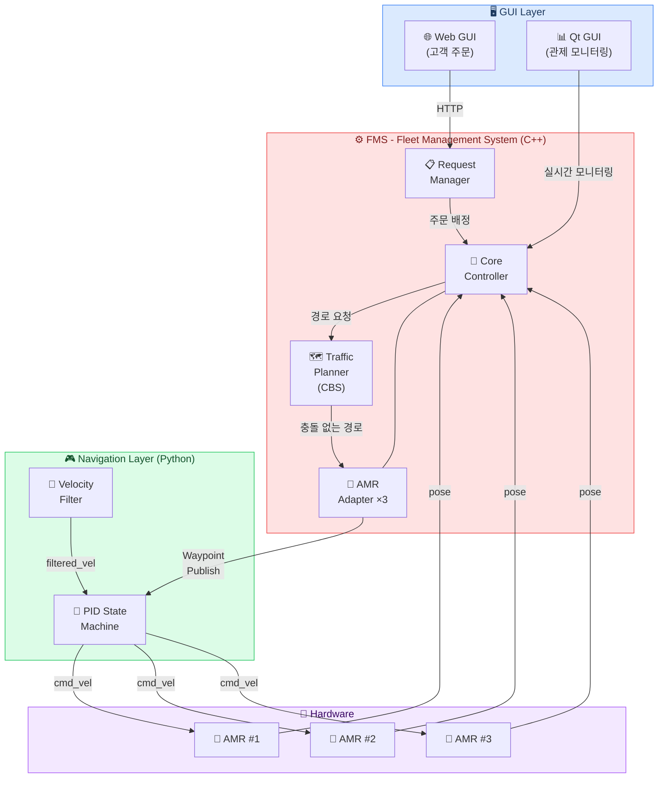
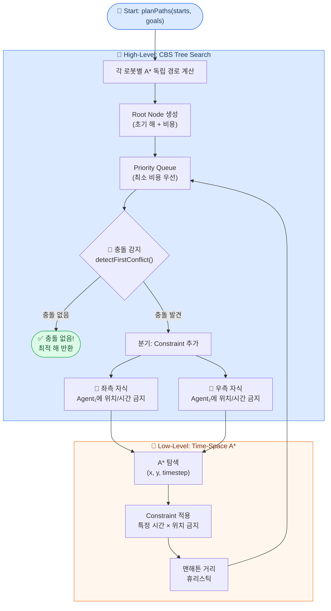
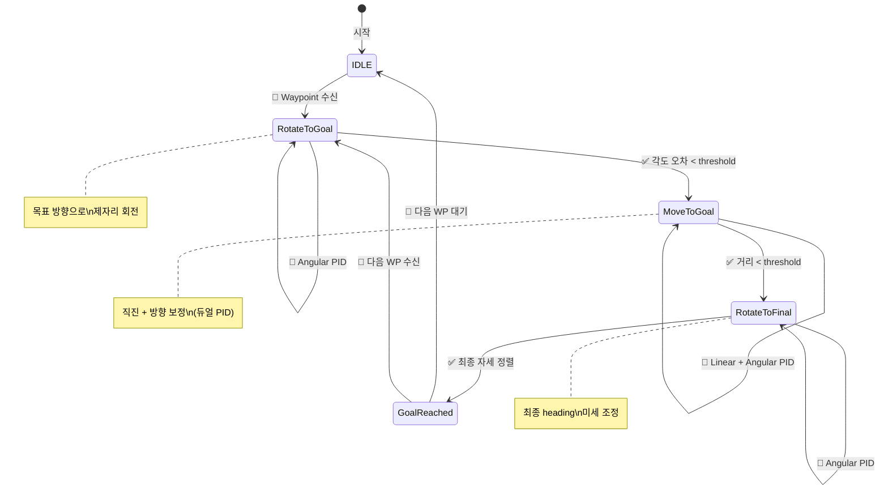
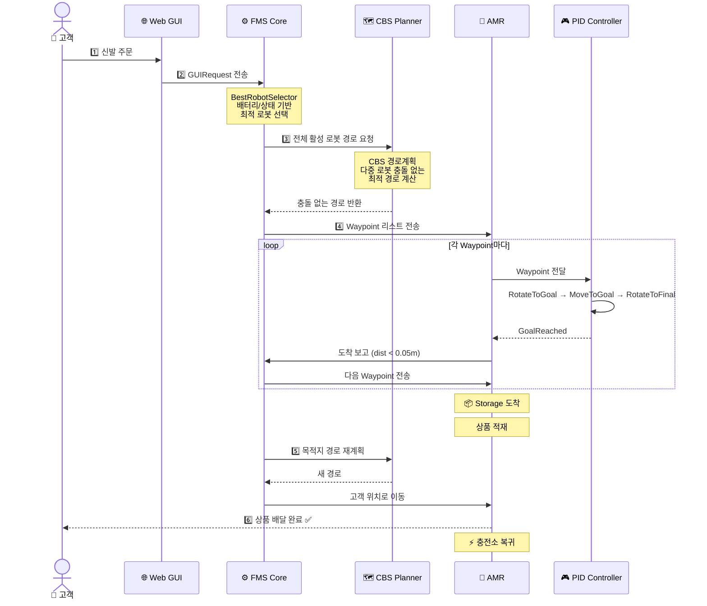
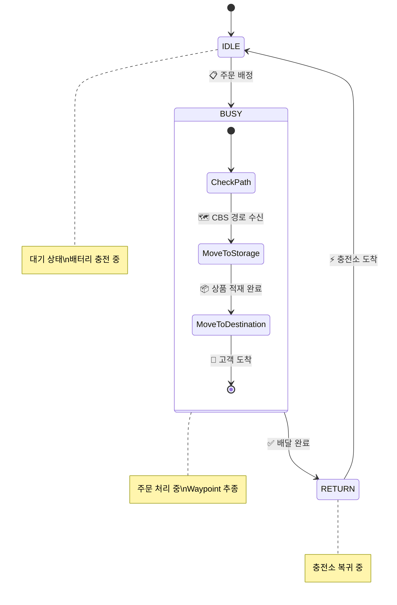

<div align="center">

<!-- Animated Typing Header -->
<a href="https://git.io/typing-svg"></a>

<br/>

<!-- Badges -->


<br/>

<!-- Project Hero GIF -->


<br/>

**창고형 무인매장에서 다수의 AMR이 충돌 없이 동시 운행하며 고객에게 상품을 배달하는 자율주행 시스템**

<br/>

[경로계획 (CBS)](#-경로계획--cbs-conflict-based-search) · [내비게이션 (PID)](#-pid-내비게이션-상태머신) · [시스템 아키텍처](#-시스템-아키텍처) · [AMR 워크플로우](#-amr-워크플로우) · [기술적 성과](#-기술적-성과)

---

</div>

## 📑 Table of Contents

```
📦 RoboCallee
├── 🏗️ 시스템 아키텍처
├── 🗺️ 경로계획 - CBS (Conflict-Based Search)
│   ├── CBS High-Level 탐색
│   ├── A* Low-Level 탐색 (시간축)
│   └── 충돌 감지 (Vertex / Edge)
├── 🎮 PID 내비게이션 상태머신
│   ├── 상태 전이 다이어그램
│   ├── PID 제어기 설계
│   └── 실시간 파라미터 튜닝
├── 🔄 AMR 워크플로우
└── 📊 기술적 성과
```

---

## 🏗️ 시스템 아키텍처



---

## 🗺️ 경로계획 — CBS (Conflict-Based Search)

<div align="center">

> 다수의 로봇이 **동시에** 이동할 때 서로 충돌하지 않는 **최적 경로**를 계산하는<br/>
> MAPF(Multi-Agent Path Finding) 알고리즘

<br/>

<table>
<tr>
<td width="50%" align="center">

<br/>
<sub><b>CBS 경로계획 시뮬레이션</b></sub>
</td>
<td width="50%" align="center">

<br/>
<sub><b>다중 로봇 경로 생성 결과</b></sub>
</td>
</tr>
</table>

</div>

### 🔍 알고리즘 구조



### ⚡ 충돌 감지: Vertex vs Edge

<div align="center">

```
   Vertex Conflict                    Edge Conflict
   (같은 시간, 같은 위치)               (교차 이동)

   t=3:  A → ● ← B                  t=3:  A ●───● B
              ↑                       t=4:  A ●───● B
         동시 점유!                          서로 교차!

   ┌─────────────────┐              ┌─────────────────┐
   │ if path[i][t]   │              │ if path[i][t]   │
   │ == path[j][t]   │              │ == path[j][t+1] │
   │                 │              │ && path[j][t]   │
   │   → Conflict!   │              │ == path[i][t+1] │
   └─────────────────┘              │   → Conflict!   │
                                    └─────────────────┘
```

</div>

<details>
<summary><b>📜 CBS 핵심 구현 코드 (C++) — 펼쳐보기</b></summary>

<br/>

**High-Level CBS 탐색**
```cpp
std::vector<std::vector<Position>> TrafficPlanner::planPaths(
    const std::vector<Position>& starts,
    const std::vector<Position>& goals)
{
    CBSNode root;
    root.constraints = {};
    root.id = 0;

    // 각 에이전트별 독립 A* 경로 계산
    for (size_t i = 0; i < starts.size(); ++i) {
        auto path = a_star(starts[i], goals[i], root.constraints, i);
        root.paths.push_back(path);
    }
    root.cost = computeCost(root.paths);

    std::priority_queue<CBSNode, std::vector<CBSNode>, std::greater<CBSNode>> open;
    open.push(root);

    while (!open.empty()) {
        CBSNode current = open.top();
        open.pop();

        // 충돌 감지
        Conflict conflict = detectFirstConflict(current.paths);
        if (conflict.agent1 == -1)
            return current.paths;  // ✅ 충돌 없는 최적 해!

        // 분기: 두 에이전트에 각각 Constraint 추가
        for (int agent : {conflict.agent1, conflict.agent2}) {
            CBSNode child = current;
            Constraint c = {agent, conflict.timestep, conflict.loc};
            child.constraints.push_back(c);

            // 해당 에이전트만 A* 재탐색
            child.paths[agent] = a_star(
                starts[agent], goals[agent], child.constraints, agent);
            child.cost = computeCost(child.paths);
            open.push(child);
        }
    }
    return {};
}
```

**Low-Level: 시간축 A\* 탐색**
```cpp
std::vector<Position> TrafficPlanner::a_star(
    const Position& start, const Position& goal,
    const std::vector<Constraint>& constraints, int agent)
{
    // 상태 공간: (x, y, timestep) — 일반 A*와의 핵심 차이점
    auto cmp = [](const Node* a, const Node* b) {
        return a->f_val() > b->f_val();
    };
    std::priority_queue<Node*, std::vector<Node*>, decltype(cmp)> open(cmp);

    Node* start_node = new Node{start, 0, manhattan(start, goal), 0, nullptr};
    open.push(start_node);

    while (!open.empty()) {
        Node* current = open.top();
        open.pop();

        if (current->pos == goal)
            return reconstructPath(current);

        // 4방향 이동 + 대기(wait)
        for (auto& [dx, dy] : directions) {
            Position next = {current->pos.x + dx, current->pos.y + dy};
            int next_t = current->timestep + 1;

            if (!isValid(next)) continue;
            if (isConstrained(agent, next, next_t, constraints)) continue;

            Node* neighbor = new Node{next, current->g_val + 1,
                                       manhattan(next, goal), next_t, current};
            open.push(neighbor);
        }
    }
    return {};
}
```

</details>

### 🗺️ 운영 맵 환경

<div align="center">

```
                     ← 22 cells (2.2m) →
    ┌──────────────────────────────────────────┐
  1 │▓▓▓▓▓▓▓▓▓▓▓▓▓▓▓▓▓▓▓▓▓▓▓▓▓▓▓▓▓▓▓▓▓▓▓▓▓▓▓▓▓▓│  ▓ = 벽/장애물
  2 │▓▓▓▓▓▓▓▓▓▓▓▓▓▓▓▓▓▓░░░░░░░░░░░░░░░░░░░░░░▓▓│  ░ = 이동 가능
  3 │▓▓▓▓▓▓▓▓░░░░░░░░░░░░░░░░░░░░░░░░░░░░░░░░░░▓▓│  ⚡ = 충전소
  4 │▓▓▓▓▓▓▓▓░░░░░░░░░░░░░░░░░░░░░░░░░░░░░░░░░░▓▓│  📦 = 창고
  5 │▓▓▓▓▓▓▓▓░░░░░░⚡░░░░░░░░░░░░░░░░░░░░░░░░░░▓▓│
  6 │▓▓▓▓▓▓▓▓▓▓▓▓▓▓▓▓▓▓░░░░░░▓▓▓▓▓▓░░░░░░░░░░░░▓▓│
  7 │▓▓▓▓▓▓▓▓▓▓▓▓▓▓▓▓▓▓📦░░░░▓▓▓▓▓▓▓▓▓▓░░░░░░░░▓▓│
  8 │▓▓▓▓▓▓▓▓▓▓▓▓▓▓▓▓▓▓░░░░░░▓▓▓▓▓▓▓▓▓▓░░░░░░░░▓▓│
  9 │▓▓▓▓▓▓▓▓▓▓▓▓▓▓▓▓▓▓░░░░░░░░░░▓▓▓▓▓▓░░░░⚡░░▓▓│
 10 │▓▓▓▓▓▓▓▓▓▓▓▓▓▓▓▓▓▓░░░░░░░░░░░░░░░░░░░░⚡░░▓▓│
 11 │▓▓▓▓▓▓▓▓▓▓▓▓▓▓▓▓▓▓░░░░░░░░░░░░░░░░░░░░░░░░▓▓│
 12 │▓▓▓▓▓▓▓▓▓▓▓▓▓▓▓▓▓▓▓▓▓▓▓▓▓▓▓▓▓▓▓▓▓▓▓▓▓▓▓▓▓▓│
    └──────────────────────────────────────────┘
         해상도: 0.1m/cell | AMR 3대 | 도착판정: 0.05m
```

</div>

<div align="center">
<table>
<tr>
<td>

| 파라미터 | 값 |
|:---:|:---:|
| 맵 크기 | `12 × 22` cells |
| 해상도 | `0.1m` / cell |
| AMR 수 | `3` 대 |
| 도착 허용 오차 | `0.05m` |

</td>
<td>

| 위치 | 좌표 |
|:---:|:---:|
| 📦 창고 (Storage) | `(6, 2)` |
| ⚡ 충전소 #1 | `(9, 8)` |
| ⚡ 충전소 #2 | `(9, 5)` |
| ⚡ 충전소 #3 | `(9, 4)` |

</td>
</tr>
</table>
</div>

---

## 🎮 PID 내비게이션 상태머신

<div align="center">

> Nav2를 사용하지 않고 직접 구현한 이유:<br/>
> **FMS와의 Waypoint 단위 통합이 더 직관적**이고, 경량화된 제어가 가능

</div>

### 🔄 상태 전이 다이어그램

<div align="center">


<sub><b>실제 동작하는 Navigation State Machine</b></sub>

</div>

<br/>



### 🎯 P 제어 vs PID 제어 비교

<div align="center">

<table>
<tr>
<td width="50%" align="center">

<br/>
<sub><b>P 제어만 적용</b> — 오버슈트, 진동 발생</sub>
</td>
<td width="50%" align="center">

<br/>
<sub><b>PID 제어 적용</b> — 안정적 수렴</sub>
</td>
</tr>
</table>

</div>

### 📐 PID 제어기 설계

<div align="center">


</div>

<br/>

$$
u(t) = \underbrace{K_p \cdot e(t)}_{\text{Proportional}} + \underbrace{K_i \int_0^t e(\tau)\,d\tau}_{\text{Integral}} + \underbrace{K_d \frac{de(t)}{dt}}_{\text{Derivative}}
$$

<br/>

<table>
<tr>
<td width="50%">

**Angular PID (방향 제어)**
```python
# 목표 방향과의 오차 계산
error = normalize_angle(target_yaw - current_yaw)

# PID 각 항 계산
P = Kp * error
I = Ki * integral      # Anti-windup 적용
D = Kd * (error - prev_error) / dt

angular_vel = P + I + D
```

</td>
<td width="50%">

**Linear PID (속도 제어)**
```python
# 목표까지의 거리
distance = hypot(
    goal.x - current.x,
    goal.y - current.y
)

# 거리 비례 속도 제어
linear_vel = Kp_linear * distance
linear_vel = clamp(linear_vel, 0, max_vel)
```

</td>
</tr>
</table>

### 🛡️ Anti-Windup

적분항이 과도하게 누적되어 오버슈트를 유발하는 **Integral Windup** 현상을 방지합니다.

```python
# ❌ Without Anti-Windup — 적분항 무한 누적
self.integral += error * dt          # 정지 상태에서도 계속 누적 → 오버슈트

# ✅ With Anti-Windup — 적분항 클램핑
self.integral += error * dt
self.integral = max(-limit, min(limit, self.integral))  # 범위 제한
```

```
                Without Anti-Windup          With Anti-Windup
  목표 ─────    ╭──╮    ╭─╮                 ╭─────────────────
               │  │   │ │                 │
               │  ╰───╯ ╰─────           │
               │      진동 & 오버슈트       │   빠른 수렴 ✅
  ─────────────╯                ───────────╯
```

### 🎛️ 실시간 PID 튜닝

<div align="center">


<sub><b>Qt GUI에서 실시간으로 PID 게인을 조정하며 로봇 동작 확인</b></sub>

</div>

<br/>

<details>
<summary><b>📜 ROS2 동적 파라미터 구현 코드 — 펼쳐보기</b></summary>

```python
class MoveToGoalPID(Node):
    def __init__(self):
        super().__init__('move_to_goal_pid')

        # 📌 ROS2 Parameter Server에 PID 게인 등록
        self.declare_parameter('angular_kp', 2.0)
        self.declare_parameter('angular_ki', 0.0)
        self.declare_parameter('angular_kd', 0.1)
        self.declare_parameter('linear_kp', 0.5)
        self.declare_parameter('angle_tolerance', 0.05)
        self.declare_parameter('dist_tolerance', 0.03)
        self.declare_parameter('windup_limit', 1.0)

        # 📌 파라미터 변경 콜백 등록
        self.add_on_set_parameters_callback(self.param_callback)

    def param_callback(self, params):
        """로봇 구동 중 실시간으로 게인 변경 가능"""
        for param in params:
            if param.name == 'angular_kp':
                self.angular_kp = param.value
            elif param.name == 'angular_ki':
                self.angular_ki = param.value
            # ... 모든 파라미터 동적 반영
        return SetParametersResult(successful=True)
```

```bash
# 터미널에서 실시간 파라미터 변경
ros2 param set /move_to_goal_pid angular_kp 3.0
ros2 param set /move_to_goal_pid angular_kd 0.2
```

</details>

---

## 🔄 AMR 워크플로우

### 전체 작업 흐름



### AMR 상태 전이



<details>
<summary><b>📜 AMR Adapter 핵심 코드 (C++) — 펼쳐보기</b></summary>

```cpp
// 🎯 Waypoint 도착 판정
bool AmrAdapter::handleWaypointArrival(const pose2f& pos) {
    Position wp = getCurrentWayPoint();
    float dist = std::hypot(pos.x - wp.x, pos.y - wp.y);

    if (dist <= 0.05f) {           // ARRIVAL_TOLERANCE
        sendNextpoint();            // → 다음 Waypoint로 진행
    }
    return true;
}

// 📍 다음 Waypoint 전송
void AmrAdapter::sendNextpoint() {
    if (isGoal()) {                 // 최종 목적지 도달?
        MoveToDone();               // → 상태 전이
        return;
    }
    incrementWaypointIndex();
    Position wp = getCurrentWayPoint();
    core->publishNavGoal(robot_id, wp);  // ROS2 토픽 퍼블리시
}

// 🔄 작업 완료 후 상태 전이
void AmrAdapter::MoveToDone() {
    switch (step_) {
        case MoveTo_Storage:         // 창고 도착
            SendPickupRequest();     // → 로봇팔에 상품 요청
            SetAmrStep(MoveTo_dst);  // → 다음: 고객에게 이동
            break;
        case MoveTo_charging_station:// 충전소 도착
            SetAmrState(IDLE);       // → 대기 상태로 전환
            break;
    }
}
```

</details>

---

## 📊 기술적 성과

<div align="center">

<table>
<tr>
<td align="center" width="25%">

### 🗺️
### CBS MAPF
**3대 AMR**<br/>동시 충돌 없는<br/>경로계획

</td>
<td align="center" width="25%">

### 🎮
### PID 제어
**Anti-Windup**<br/>실시간 튜닝<br/>안정적 수렴

</td>
<td align="center" width="25%">

### 🔄
### 실시간 재계획
**로봇 추가/복귀 시**<br/>전체 경로<br/>자동 재계산

</td>
<td align="center" width="25%">

### ⚡
### Nav2 대체
**경량 제어기**<br/>FMS 연동 최적화<br/>Waypoint 추종

</td>
</tr>
</table>

</div>

### 💡 배운 점

<table>
<tr>
<td>🗺️</td>
<td><b>MAPF 알고리즘</b></td>
<td>단일 로봇 경로계획과 달리 다중 로봇 환경에서는 <b>시간축</b>까지 고려해야 하며, CBS가 최적성을 보장하면서도 실용적인 해를 제공한다는 것을 체감</td>
</tr>
<tr>
<td>🎛️</td>
<td><b>PID 튜닝</b></td>
<td>이론적 게인과 실제 로봇에서의 최적 게인은 큰 차이가 있으며, <b>실시간 튜닝 인프라</b>의 필요성을 경험</td>
</tr>
<tr>
<td>🔧</td>
<td><b>시스템 통합</b></td>
<td>경로계획 → 제어기 → 하드웨어 간의 <b>인터페이스 설계</b>가 전체 시스템 안정성에 결정적 영향을 미침</td>
</tr>
<tr>
<td>🤖</td>
<td><b>Nav2 vs 직접 구현</b></td>
<td>기존 프레임워크의 장단점을 비교하고, 프로젝트 요구사항에 맞는 <b>기술 선택의 중요성</b>을 학습</td>
</tr>
</table>

---

<div align="center">

### 🔗 Links

[](https://github.com/addinedu-roscamp-5th/roscamp-repo-3)

<br/>

<sub>Built with ROS2 Humble · C++17 · Python 3 · CBS Algorithm · PID Control</sub>

</div>
