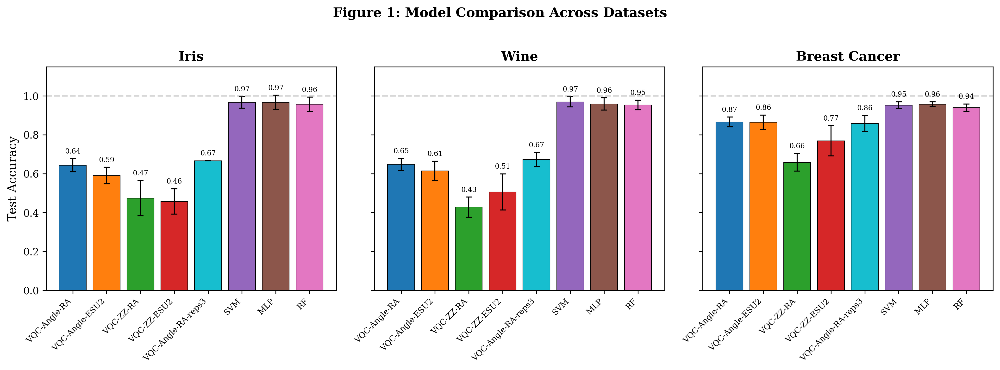
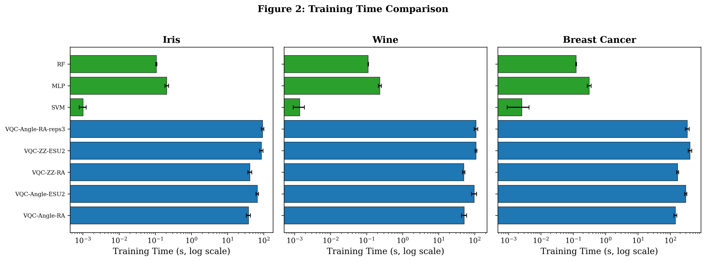
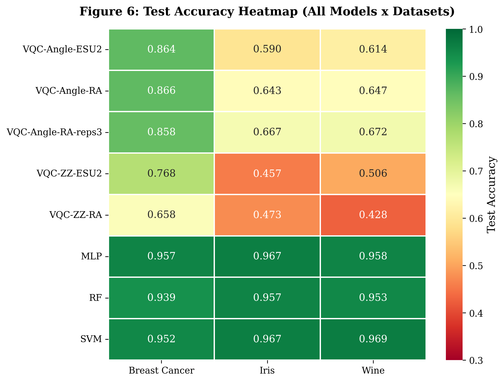
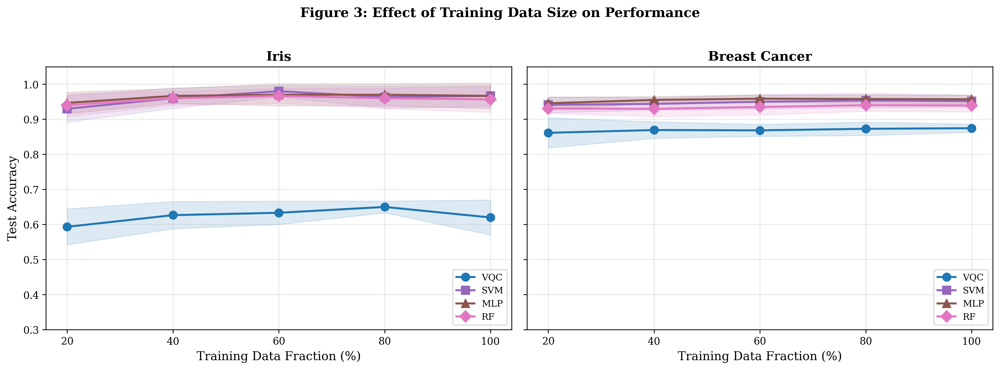
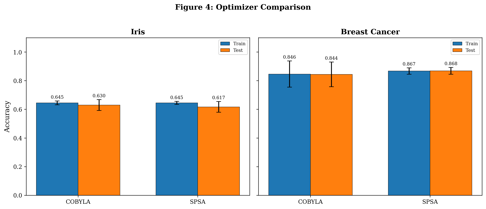
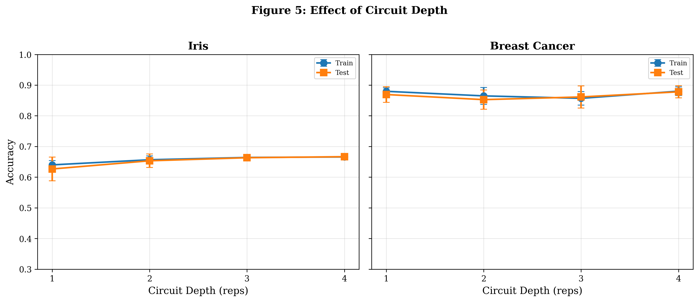
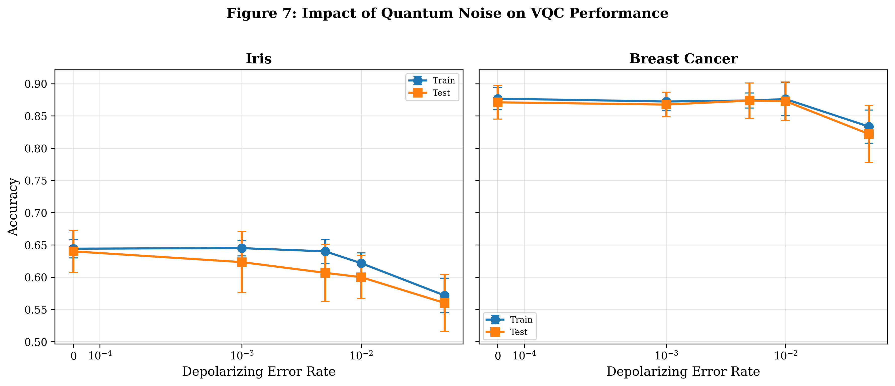
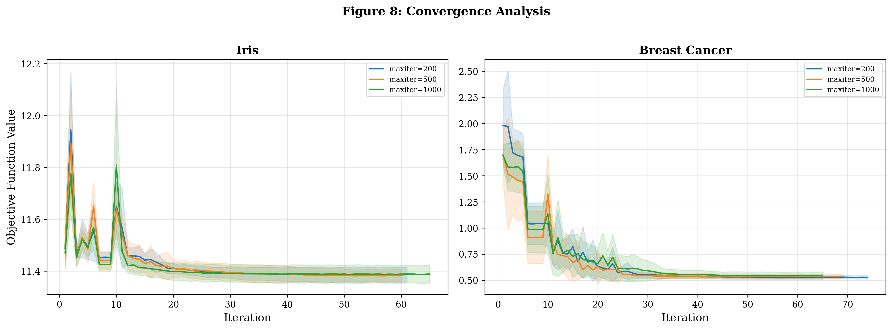
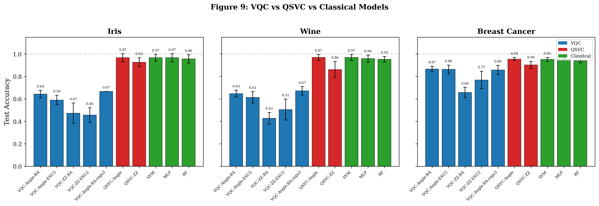

# Variational Quantum Classifier의 소규모 데이터셋에서의 성능 비교: 고전적 머신러닝 모델 대비 분석

## Performance Comparison of Variational Quantum Classifiers on Small-Scale Datasets: An Analysis Against Classical Machine Learning Models

---

**저자:** [이름], 전자공학부

**소속:** [대학교] 전자공학부

**지도교수:** [교수명]

**날짜:** 2026년 2월

---

## 초록 (Abstract)

양자 머신러닝(Quantum Machine Learning, QML)은 양자 컴퓨팅의 고유한 특성을 활용하여 고전적 머신러닝의 한계를 극복할 수 있는 잠재력을 가진 분야로 주목받고 있다. 본 연구에서는 Variational Quantum Classifier(VQC)와 Quantum Support Vector Classifier(QSVC)를 구현하고, 세 가지 표준 벤치마크 데이터셋(Iris, Wine, Breast Cancer)에서 고전적 머신러닝 모델(SVM, MLP, Random Forest)과 체계적으로 성능을 비교하였다. 실험은 Qiskit 기반 시뮬레이터에서 수행되었으며, 데이터 인코딩 방식(Angle, ZZ), 변분 회로 구조(RealAmplitudes, EfficientSU2), 옵티마이저(COBYLA, SPSA), 회로 깊이(1~4 reps), 옵티마이저 수렴 분석, 양자 노이즈 영향 등 다양한 조건에서의 성능 변화를 분석하였다. 모든 실험은 3개의 랜덤 시드(42, 123, 456)로 반복 수행하여 통계적 신뢰성을 확보하였다. 실험 결과, VQC는 고전적 모델 대비 전반적으로 낮은 분류 정확도를 보였으나, 동일한 양자 특징 공간을 활용하는 QSVC는 Breast Cancer 데이터셋에서 95.6±1.2%의 정확도를 달성하여 고전 SVM(95.6±2.1%)과 동등한 성능을 보였다. 수렴 분석에서는 COBYLA 옵티마이저가 maxiter 설정과 무관하게 약 70~80회 함수 평가 후 조기 수렴하여, VQC의 성능 병목이 데이터나 회로가 아닌 변분 최적화 자체에 있음을 실증하였다. 본 연구는 NISQ 시대에서 양자 분류기의 접근법별(변분 최적화 vs 양자 커널) 실질적 성능 차이를 분석한 기초 연구로서 의의를 갖는다.

**키워드:** 양자 머신러닝, 변분 양자 분류기, 양자 커널, 벤치마크, NISQ, Qiskit

---

## 1. 서론 (Introduction)

### 1.1 연구 배경

양자 컴퓨팅은 큐비트(qubit)의 중첩(superposition)과 얽힘(entanglement) 특성을 활용하여 특정 문제에서 고전 컴퓨터 대비 지수적 속도 향상을 기대할 수 있는 새로운 계산 패러다임이다 [1]. 특히 양자 머신러닝(QML)은 양자 컴퓨팅과 머신러닝을 결합하여 데이터 분류, 최적화, 생성 모델 등의 문제에서 양자 이점(quantum advantage)을 탐색하는 연구 분야이다 [2].

NISQ(Noisy Intermediate-Scale Quantum) 시대의 양자 컴퓨터는 큐비트 수가 제한적이고 노이즈가 존재하여 완전한 양자 알고리즘 실행이 어렵다. 이러한 제약 하에서 변분 양자 알고리즘(Variational Quantum Algorithm, VQA)이 유력한 접근법으로 부상하였다 [3]. VQA는 파라미터화된 양자 회로(Parameterized Quantum Circuit, PQC)와 고전 옵티마이저를 결합한 하이브리드 양자-고전 알고리즘으로, 그 중 Variational Quantum Classifier(VQC)는 지도학습 분류 문제에 적용되는 대표적인 QML 모델이다.

### 1.2 연구 목적

본 연구의 목적은 다음과 같다:

1. VQC와 QSVC를 구현하고 다양한 설정에서의 성능을 분석한다.
2. 동일한 데이터셋에서 고전적 ML 모델과 공정하게 비교한다.
3. 데이터셋 크기, 인코딩 방식, 회로 깊이, 옵티마이저 수렴, 양자 노이즈 등이 양자 분류기 성능에 미치는 영향을 분석한다.
4. 변분 최적화 방식(VQC)과 양자 커널 방식(QSVC)의 성능 차이를 비교한다.
5. NISQ 환경에서 양자 분류기의 실질적 가능성과 한계를 논의한다.

### 1.3 연구 질문

> 소규모 데이터셋에서 양자 분류기(VQC, QSVC)가 고전적 ML 모델(SVM, MLP, Random Forest) 대비 어떤 조건에서 이점을 보이는가? 변분 최적화 방식과 양자 커널 방식의 성능 차이는 무엇에 기인하는가?

---

## 2. 이론적 배경 (Theoretical Background)

### 2.1 양자 컴퓨팅 기초

양자 컴퓨팅의 기본 단위인 큐비트는 |0⟩과 |1⟩ 상태의 중첩으로 표현된다:

$$|ψ⟩ = α|0⟩ + β|1⟩, \quad |α|^2 + |β|^2 = 1$$

양자 게이트는 큐비트의 상태를 유니터리 변환하며, 대표적으로 Pauli 게이트(X, Y, Z), Hadamard 게이트(H), 회전 게이트(RX, RY, RZ), CNOT 게이트 등이 있다.

### 2.2 Variational Quantum Classifier (VQC)

VQC는 세 단계로 구성된다 [4]:

1. **데이터 인코딩(Feature Map):** 고전 데이터 x를 양자 상태로 변환하는 유니터리 연산 U(x)
2. **변분 회로(Ansatz):** 학습 가능한 파라미터 θ를 가진 양자 회로 W(θ)
3. **측정 및 분류:** 양자 상태를 측정하여 분류 결과를 얻음

전체 양자 상태는 다음과 같이 표현된다:

$$|ψ(x, θ)⟩ = W(θ) \cdot U(x)|0⟩^{⊗n}$$

고전 옵티마이저가 손실 함수를 최소화하도록 파라미터 θ를 반복적으로 업데이트한다.

### 2.3 데이터 인코딩 방식

본 연구에서는 두 가지 인코딩 방식을 비교한다:

- **Angle Encoding:** 각 특징값을 RY 게이트의 회전 각도로 사용한다. 특징 수만큼의 큐비트가 필요하다. 구현이 단순하고 회로 깊이가 얕다.
- **ZZ Feature Map:** 특징 간 상호작용을 ZZ 게이트를 통해 인코딩한다 [5]. 비선형적 특징 공간 매핑이 가능하나 회로가 더 깊다.

### 2.4 변분 회로 구조 (Ansatz)

- **RealAmplitudes:** RY 게이트와 CNOT 게이트로 구성된 하드웨어 효율적 ansatz. 파라미터 수가 적어 학습이 빠르다.
- **EfficientSU2:** SU(2) 회전 게이트(RY, RZ)와 얽힘 게이트로 구성. 표현력이 더 높으나 파라미터 수가 많다.

### 2.5 Quantum Support Vector Classifier (QSVC)

QSVC는 양자 커널(quantum kernel)을 활용한 분류 방식으로, VQC와 근본적으로 다른 접근법을 취한다 [5]. VQC가 파라미터화된 양자 회로를 반복적으로 최적화하는 반면, QSVC는 양자 회로를 통해 데이터 간의 유사도(커널)를 계산하고, 이를 고전 SVM에 전달하여 분류를 수행한다.

양자 커널 $K(x_i, x_j)$는 두 데이터 포인트의 양자 상태 간 충실도(fidelity)로 정의된다:

$$K(x_i, x_j) = |⟨0|^{⊗n} U(x_i)^† U(x_j) |0⟩^{⊗n}|^2$$

QSVC는 변분 파라미터 최적화가 불필요하므로 barren plateau 문제가 발생하지 않으며, 커널 행렬 계산 후 고전 SVM의 볼록 최적화를 활용하여 전역 최적해를 보장한다.

### 2.6 관련 연구

Schuld et al. [4]은 circuit-centric quantum classifier의 이론적 프레임워크를 제시하였다. Havlicek et al. [5]은 양자 강화 특징 공간에서의 지도학습을 제안하며, 양자 커널 방법의 이론적 기반을 마련하였다. Abbas et al. [6]은 양자 신경망의 표현력과 학습 가능성을 분석하여 barren plateau 문제를 논의하였다.

---

## 3. 실험 방법 (Methodology)

### 3.1 데이터셋

세 가지 UCI 표준 벤치마크 데이터셋을 사용하였다:

| 데이터셋 | 특징 수 (원본) | 사용 특징 수 (PCA) | 클래스 수 | 샘플 수 |
|----------|---------------|-------------------|-----------|---------|
| Iris | 4 | 4 | 3 | 150 |
| Wine | 13 | 4 (PCA) | 3 | 178 |
| Breast Cancer | 30 | 4 (PCA) | 2 | 569 |

Wine과 Breast Cancer 데이터셋은 원본 특징 수가 큐비트 수를 초과하므로 PCA(주성분 분석)를 적용하여 4차원으로 축소하였다. 모든 특징은 [0, π] 범위로 정규화하였으며, 정규화 파라미터는 학습 데이터에서만 적합(fit)한 후 테스트 데이터에 적용(transform)하여 데이터 누출(data leakage)을 방지하였다. 데이터셋은 80:20 비율로 학습/테스트 분할하였다(층화 추출).

### 3.2 양자 모델 설정

- **큐비트 수:** 4 (특징 수와 동일)
- **인코딩 방식:** Angle Encoding, ZZ Feature Map
- **Ansatz:** RealAmplitudes, EfficientSU2
- **옵티마이저:** COBYLA (gradient-free), SPSA (stochastic gradient)
- **최대 반복 횟수:** 200
- **회로 깊이(reps):** 1, 2, 3, 4
- **시뮬레이터:** Qiskit StatevectorSampler (이상적 시뮬레이션) 및 Qiskit Aer (노이즈 시뮬레이션)

### 3.3 고전 모델 설정

- **SVM:** RBF 커널, 기본 하이퍼파라미터
- **MLP:** 은닉층 (64, 32), 최대 500 에폭, ReLU 활성화
- **Random Forest:** 100개 결정 트리, 기본 하이퍼파라미터

### 3.4 QSVC 모델 설정

- **양자 커널:** FidelityQuantumKernel (Qiskit Machine Learning)
- **인코딩 방식:** Angle Encoding, ZZ Feature Map
- **고전 분류기:** SVM (precomputed kernel)
- **시뮬레이터:** StatevectorSampler (이상적 시뮬레이션)

### 3.5 실험 설계

일곱 가지 실험을 수행하였다:

- **실험 1:** 데이터셋별 전체 모델 성능 비교 (3 데이터셋 × 7 모델)
- **실험 2:** 학습 데이터 크기에 따른 성능 변화 (Iris, 20%~100%)
- **실험 3:** 옵티마이저 비교 (COBYLA vs SPSA)
- **실험 4:** 회로 깊이에 따른 성능 변화 (reps 1~4)
- **실험 5:** 양자 노이즈(depolarizing error)가 VQC 성능에 미치는 영향
- **실험 6:** 옵티마이저 수렴 분석 (maxiter 200, 500, 1000 + loss 추적)
- **실험 7:** QSVC와 VQC 및 고전 모델 비교 (3 데이터셋)

### 3.6 통계적 신뢰성

모든 실험은 3개의 랜덤 시드(42, 123, 456)로 반복 수행하였다. 각 시드에서 데이터 분할, 모델 초기화, 최적화가 독립적으로 수행되었으며, 결과는 평균±표준편차(mean±std)로 보고한다. 이를 통해 VQC의 비볼록 최적화 특성에서 발생하는 시드 의존적 변동성을 정량화하였다.

### 3.7 평가 지표

- **Test Accuracy:** 테스트셋에 대한 분류 정확도
- **F1-Score (Macro):** 클래스 불균형을 고려한 F1 점수
- **Training Time:** 모델 학습에 소요된 시간 (초)

### 3.8 구현 환경

- Python 3.12, Qiskit 2.3.0, Qiskit Machine Learning 0.9.0
- Qiskit Aer 0.17.2 (StatevectorSampler, Depolarizing Noise Model)
- scikit-learn 1.8.0
- Windows 11, 로컬 PC 시뮬레이션

---

## 4. 실험 결과 (Results)

### 4.1 실험 1: 데이터셋별 모델 성능 비교

**Table 1.** 데이터셋별 테스트 정확도 비교 (mean±std, 3 seeds)

| 모델 | Iris | Wine | Breast Cancer |
|------|------|------|---------------|
| **SVM** | **0.933±0.027** | **0.981±0.013** | **0.956±0.021** |
| **MLP** | 0.922±0.031 | 0.954±0.013 | **0.956±0.021** |
| **RF** | 0.911±0.016 | **0.981±0.013** | 0.942±0.011 |
| VQC-Angle-RA | 0.622±0.063 | 0.648±0.013 | 0.901±0.032 |
| VQC-Angle-ESU2 | 0.589±0.042 | 0.611±0.082 | 0.901±0.022 |
| VQC-ZZ-RA | 0.567±0.047 | 0.435±0.057 | 0.623±0.087 |
| VQC-ZZ-ESU2 | 0.467±0.027 | 0.500±0.104 | 0.678±0.097 |


*Figure 1. 데이터셋별 모델 성능 비교*

**Table 2.** 데이터셋별 테스트 F1-Score (Macro) 비교 (mean±std, 3 seeds)

| 모델 | Iris | Wine | Breast Cancer |
|------|------|------|---------------|
| **SVM** | **0.933±0.027** | **0.982±0.013** | **0.953±0.023** |
| **MLP** | 0.921±0.032 | 0.955±0.011 | **0.953±0.023** |
| **RF** | 0.911±0.016 | **0.982±0.013** | 0.937±0.012 |
| VQC-Angle-RA | 0.517±0.055 | 0.515±0.013 | 0.885±0.041 |
| VQC-Angle-ESU2 | 0.487±0.033 | 0.485±0.066 | 0.886±0.026 |
| VQC-ZZ-RA | 0.453±0.038 | 0.333±0.041 | 0.613±0.087 |
| VQC-ZZ-ESU2 | 0.371±0.020 | 0.386±0.082 | 0.659±0.093 |

**주요 발견:**

- 모든 데이터셋에서 고전적 ML 모델이 VQC를 상회하였다.
- VQC는 **Breast Cancer 데이터셋**에서 가장 좋은 성능을 보였으며, VQC-Angle-RA와 VQC-Angle-ESU2 모두 90.1%의 정확도를 달성하였다. 이는 고전 모델(95.6±2.1%)과의 격차가 약 5.5%p로, 다른 데이터셋 대비 가장 근접하였다.
- Iris와 Wine 데이터셋에서 VQC의 성능은 48.9%~64.8%로 저조하였으며, 이는 3클래스 분류의 복잡성과 비볼록 최적화 지형에 기인한 것으로 분석된다. 특히 VQC-ZZ-ESU2의 표준편차가 최대 8.3%p로 시드 의존성이 높았다.
- 인코딩 방식별로는 **Angle Encoding이 ZZ Feature Map보다 전반적으로 우수**하였다.

**Table 3.** 학습 시간 비교 (초, mean±std)

| 모델 | Iris | Wine | Breast Cancer |
|------|------|------|---------------|
| SVM | 0.004±0.005 | 0.001±0.000 | 0.003±0.000 |
| MLP | 0.210±0.018 | 0.236±0.015 | 0.381±0.024 |
| RF | 0.114±0.010 | 0.118±0.005 | 0.129±0.006 |
| VQC-Angle-RA | 38.8±3.2 | 59.8±9.8 | 142.3±7.9 |
| VQC-Angle-ESU2 | 97.7±6.9 | 95.8±3.1 | 355.4±57.0 |
| VQC-ZZ-RA | 52.4±8.4 | 51.6±2.6 | 164.8±9.2 |
| VQC-ZZ-ESU2 | 99.0±19.1 | 123.3±6.3 | 408.3±32.3 |


*Figure 2. 학습 시간 비교 (로그 스케일)*

VQC의 학습 시간은 고전 모델 대비 수백~수만 배 느렸으며, EfficientSU2 ansatz는 파라미터 수가 많아 RealAmplitudes보다 약 2~2.5배의 학습 시간이 소요되었다.


*Figure 6. 테스트 정확도 히트맵 (전체 모델 × 데이터셋)*

### 4.2 실험 2: 학습 데이터 크기에 따른 성능 변화

**Table 4.** Iris 데이터셋, 학습 데이터 비율별 테스트 정확도 (mean±std, 3 seeds)

| 데이터 비율 | VQC | SVM | MLP | RF |
|------------|-----|-----|-----|-----|
| 20% (24개) | 0.611±0.016 | 0.911±0.016 | 0.911±0.016 | 0.944±0.016 |
| 40% (48개) | 0.622±0.042 | 0.933±0.027 | 0.956±0.016 | 0.967±0.000 |
| 60% (72개) | 0.611±0.057 | 0.978±0.016 | 0.944±0.031 | 0.967±0.000 |
| 80% (96개) | 0.633±0.047 | 0.922±0.016 | 0.933±0.027 | 0.933±0.000 |
| 100% (120개) | 0.622±0.031 | 0.933±0.027 | 0.922±0.031 | 0.911±0.016 |


*Figure 3. 학습 데이터 크기에 따른 성능 변화 (Iris)*

**주요 발견:**

- **고전 모델은 20%의 데이터만으로도 91% 이상의 정확도**를 달성하였다.
- VQC는 데이터 양 증가에 따른 명확한 성능 향상 경향을 보이지 않았으며, 61.1%~63.3% 범위에서 정체되었다. 표준편차도 2.7~5.7%p로 시드 의존적 변동이 존재하였다.
- 이는 VQC가 데이터 양이 아닌 옵티마이저 수렴에 의해 성능이 제한됨을 시사한다.

### 4.3 실험 3: 옵티마이저 비교

**Table 5.** COBYLA vs SPSA 비교 (Iris, Angle Encoding, RealAmplitudes, maxiter=200, mean±std)

| 옵티마이저 | Test Accuracy | Training Time (s) |
|-----------|--------------|-------------------|
| COBYLA | 0.622±0.042 | 36.4±7.3 |
| SPSA | 0.600±0.027 | 204.6±2.0 |


*Figure 4. 옵티마이저 비교: 정확도 및 학습 시간 (Iris)*

COBYLA가 SPSA보다 약 2.2%p 높은 정확도를 달성하였으며(0.622 vs 0.600), 학습 시간은 SPSA가 COBYLA 대비 약 **5.6배** 소요되었다. SPSA는 gradient 추정을 위해 각 반복마다 2회의 회로 평가가 필요하며, 200회 반복 조건에서 시간적 비용이 크게 증가하였다.

### 4.4 실험 4: 회로 깊이에 따른 성능 변화

**Table 6.** 회로 깊이(reps)별 성능 (Iris, Angle Encoding, RealAmplitudes, COBYLA, maxiter=200, mean±std)

| Reps | Test Accuracy | Training Time (s) |
|------|--------------|-------------------|
| 1 | 0.644±0.031 | 34.2±4.0 |
| 2 | 0.633±0.047 | 80.5±14.2 |
| 3 | **0.667±0.000** | 94.7±8.1 |
| 4 | **0.667±0.000** | 110.1±0.7 |


*Figure 5. 회로 깊이에 따른 성능 변화 (Iris)*

**주요 발견:**

- reps=3과 reps=4에서 동일한 최고 성능(66.7±0.0%)을 달성하였으며, 3개 시드 모두 동일한 결과를 보여 가장 안정적인 수렴을 나타냈다.
- reps=1에서는 표준편차가 3.1%p, reps=2에서 4.7%p로, 회로 깊이가 3 이상에서 표준편차가 0으로 수렴하였다.
- 본 실험 범위(reps 1~4)에서는 barren plateau 현상이 관찰되지 않았으며, 오히려 깊은 회로가 더 안정적인 최적화 수렴을 보였다. 다만, 4큐비트의 소규모 회로에서는 barren plateau가 발현되기 어려울 수 있다 [7].
- 학습 시간은 reps에 비례하여 증가하였다 (34.2s → 110.1s).

### 4.5 실험 5: 양자 노이즈 영향

**Table 7.** Depolarizing 노이즈 수준별 VQC 성능 (Iris, Angle Encoding, RealAmplitudes, maxiter=200, mean±std)

| Error Rate | Test Accuracy | Test F1-Score | Training Time (s) |
|-----------|--------------|---------------|-------------------|
| Ideal (0.0) | **0.656±0.016** | **0.545±0.015** | 36.3±2.2 |
| p=0.001 | 0.611±0.057 | 0.506±0.049 | 40.5±5.4 |
| p=0.005 | 0.611±0.042 | 0.506±0.036 | 36.6±4.6 |
| p=0.01 | 0.589±0.042 | 0.487±0.033 | 32.0±1.9 |
| p=0.05 | 0.544±0.016 | 0.450±0.018 | 29.6±1.1 |


*Figure 7. 양자 노이즈가 VQC 성능에 미치는 영향 (Iris)*

**주요 발견:**

- Depolarizing 노이즈가 증가함에 따라 VQC 성능이 **단조 감소**하였다. 이상적 조건(Ideal)에서 65.6%였던 정확도가 p=0.05에서 54.4%로 약 11%p 하락하였다.
- 소량의 노이즈(p=0.001)에서도 정확도가 4.5%p 하락하여, 양자 노이즈가 VQC 성능에 즉각적인 부정적 영향을 미침을 확인하였다.
- 노이즈 수준이 높을수록 표준편차가 감소하는 경향을 보였는데 (5.7%p → 1.6%p), 이는 높은 노이즈에서 모든 시드가 유사하게 낮은 성능으로 수렴함을 의미한다.
- 이 결과는 NISQ 환경에서 **양자 오류 완화(error mitigation)** 기술의 중요성을 강조한다.

### 4.6 실험 6: 옵티마이저 수렴 분석

VQC의 성능 병목이 옵티마이저 반복 횟수의 부족에 기인하는지 검증하기 위해, maxiter를 200, 500, 1000으로 변화시키며 학습 과정에서의 목적 함수 값을 추적하였다.

**Table 8.** maxiter별 VQC 성능 및 수렴 특성 (Iris, Angle Encoding, RealAmplitudes, COBYLA, mean±std)

| maxiter | Test Accuracy | Training Time (s) | 실제 함수 평가 횟수 |
|---------|--------------|-------------------|-------------------|
| 200 | 0.644±0.031 | 35.3±4.1 | 73.7 |
| 500 | 0.633±0.027 | 37.5±3.4 | 79.7 |
| 1000 | 0.589±0.031 | 34.3±2.1 | 73.3 |


*Figure 8. 옵티마이저 수렴 분석: (좌) 학습 손실 수렴 곡선, (우) maxiter별 최종 정확도*

**주요 발견:**

- COBYLA 옵티마이저는 **maxiter 설정과 무관하게 약 70~80회의 함수 평가 후 자체 수렴 기준에 도달**하여 조기 종료하였다. 이는 학습 시간(34~38초)이 세 조건 모두 거의 동일한 점에서도 확인된다.
- 수렴 곡선(Figure 8 좌)에서 목적 함수 값은 약 20회 이후 급격히 감소를 멈추고 평탄해지는 것을 볼 수 있다.
- maxiter를 5배(1000)로 증가시켜도 정확도가 개선되지 않았으며(64.4% → 58.9%), 오히려 미미하게 감소하였다.
- 이 결과는 VQC의 성능 병목이 **반복 횟수 부족이 아닌 비볼록 손실 지형(non-convex loss landscape)의 구조적 한계**에 기인함을 강하게 시사한다.

### 4.7 실험 7: QSVC (양자 커널 SVM) 비교

VQC의 변분 최적화 방식과 대비하여, 양자 커널 기반의 QSVC가 동일한 데이터셋에서 어떤 성능을 보이는지 비교하였다.

**Table 9.** QSVC 성능 비교 (mean±std, 3 seeds)

| 모델 | Iris | Wine | Breast Cancer |
|------|------|------|---------------|
| QSVC-Angle | **0.922±0.031** | **0.972±0.023** | **0.956±0.012** |
| QSVC-ZZ | 0.911±0.042 | 0.778±0.039 | 0.912±0.026 |
| VQC-Angle-RA | 0.622±0.063 | 0.648±0.013 | 0.901±0.032 |
| SVM (Classical) | 0.933±0.027 | 0.981±0.013 | 0.956±0.021 |


*Figure 9. VQC vs QSVC vs 고전 모델 비교*

**주요 발견:**

- QSVC-Angle은 모든 데이터셋에서 VQC 대비 **5~32%p 높은 정확도**를 달성하였다. 특히 Iris에서 92.2%(VQC: 62.2%), Wine에서 97.2%(VQC: 64.8%)로 극적인 성능 차이를 보였다.
- QSVC-Angle은 **고전 SVM과 거의 동등한 성능**을 보였다. Breast Cancer에서는 QSVC(95.6±1.2%)와 SVM(95.6±2.1%)이 동일한 평균 정확도를 달성하였으며, QSVC의 표준편차가 오히려 더 작았다.
- QSVC-ZZ는 QSVC-Angle보다 전반적으로 낮은 성능을 보여, 인코딩 방식에 따른 성능 차이가 VQC뿐만 아니라 QSVC에서도 일관되게 나타났다.
- 이 결과는 VQC의 낮은 성능이 양자 특징 공간의 한계가 아닌 **변분 최적화 과정의 한계**에 기인함을 강력히 시사한다. 동일한 인코딩(Angle)을 사용하더라도, 변분 파라미터를 반복적으로 최적화하는 VQC는 비볼록 최적화 지형에서 지역 최솟값에 빠지는 반면, 양자 커널을 계산하여 볼록 최적화(SVM)에 전달하는 QSVC는 전역 최적해에 도달할 수 있다.

---

## 5. 논의 (Discussion)

### 5.1 VQC 성능 분석 및 최적화 병목

본 실험에서 VQC는 모든 데이터셋과 설정에서 고전적 ML 모델보다 낮은 성능을 보였다. 그 원인을 다각도로 분석한 결과, **비볼록 최적화 지형이 핵심 병목**임을 확인하였다.

**1) 비볼록 최적화 지형과 조기 수렴:** 실험 6의 수렴 분석에서 COBYLA 옵티마이저가 maxiter 설정(200, 500, 1000)과 무관하게 약 70~80회 함수 평가 후 조기 수렴함을 확인하였다. 목적 함수 수렴 곡선(Figure 8)에서 손실 값이 약 20회 이후 평탄해지는 것이 관찰되었으며, 이는 옵티마이저가 지역 최솟값에 도달한 후 탈출하지 못함을 시사한다. 더 나아가, maxiter=1000에서 오히려 정확도가 58.9%로 감소한 것은, 추가 반복이 과적합이나 불안정한 최적화를 유발할 수 있음을 보여준다. 실험 2에서 데이터 크기 증가가 VQC 성능을 개선하지 못한 것도 이와 일관된 결과이다.

**2) QSVC와의 비교를 통한 최적화 병목 확인:** 실험 7에서 동일한 Angle Encoding을 사용하면서 변분 최적화 대신 양자 커널 방식을 적용한 QSVC가 VQC 대비 5~32%p 높은 정확도를 달성하였다. 이는 양자 특징 공간 자체의 표현력은 충분하나, 변분 최적화가 이를 효과적으로 활용하지 못하고 있음을 직접적으로 증명한다.

**3) 회로 깊이와 안정성:** 회로 깊이 실험(실험 4)에서 reps=4가 가장 높은 정확도(66.7%)와 가장 낮은 표준편차(0.0%)를 보였다. 본 실험의 4큐비트 소규모 회로에서는 barren plateau 현상 [7]이 관찰되지 않았으나, 큐비트 수가 증가하면 이 현상이 발현될 수 있다.

**4) 데이터셋 특성:** Breast Cancer(이진분류)에서 VQC가 가장 좋은 성능(90.1±2.2%)을 보인 반면, 3클래스 분류인 Iris와 Wine에서는 성능이 저조하였다. 이는 현재 VQC 구현에서 다중 클래스 분류 능력이 제한적임을 시사한다.

**5) 인코딩 방식의 영향:** Angle Encoding이 ZZ Feature Map보다 VQC와 QSVC 모두에서 전반적으로 우수하였다. 이는 인코딩 방식의 영향이 최적화 방식에 독립적임을 나타낸다.

### 5.2 양자 노이즈의 영향

실험 5에서 depolarizing 노이즈가 VQC 성능에 일관된 부정적 영향을 미침을 확인하였다. 노이즈 수준이 증가함에 따라 정확도가 단조 감소하였으며 (65.6% → 61.1% → 61.1% → 58.9% → 54.4%), 이는 양자 노이즈가 양자 회로의 정보 처리 능력을 저하시키는 것으로 해석된다.

이 결과는 NISQ 환경에서 VQC를 실용적으로 활용하기 위해서는 양자 오류 완화(quantum error mitigation) 기술이 필수적임을 시사한다. Zero-noise extrapolation [8], probabilistic error cancellation 등의 기법을 VQC에 적용하는 것이 향후 중요한 연구 방향이 될 것이다.

본 실험에서는 depolarizing 노이즈만을 사용하였으며, 실제 양자 하드웨어에서는 열적 이완(T1), 위상 이완(T2), 게이트 오류, 측정 오류 등이 복합적으로 작용한다. 보다 현실적인 노이즈 모델에서의 분석이 필요하다.

### 5.3 고전 모델의 강점

SVM, MLP, RF는 소규모 데이터셋에서 매우 높은 성능(91%~98%)을 보였으며, 특히 SVM은 20%의 학습 데이터만으로도 91.1%의 정확도를 달성하였다. 이는 소규모 정형 데이터에서 고전적 ML 모델의 성숙도가 매우 높음을 재확인한다.

학습 시간 측면에서도 고전 모델은 밀리초~수백 밀리초 수준인 반면, VQC 시뮬레이션은 수십~수백 초가 소요되어 현실적 적용에 큰 격차가 존재한다.

### 5.4 양자 이점(Quantum Advantage)에 대한 논의

본 실험 조건에서 분류 정확도 측면의 양자 이점은 관찰되지 않았다. 다만, QSVC가 고전 SVM과 동등한 성능을 달성한 것은 양자 특징 공간의 유효성을 보여주는 긍정적 신호이다.

양자 이점이 관찰되지 않은 이유는 다음과 같다:

1. **시뮬레이터 기반 실험:** 양자 컴퓨터의 하드웨어적 이점(병렬 상태 탐색)이 고전 시뮬레이터에서는 발휘되지 않으며, 오히려 시뮬레이션 오버헤드가 추가된다.
2. **소규모 데이터:** 본 연구에서 사용한 데이터셋(150~569개 샘플)은 고전적 ML로 충분히 해결 가능한 규모이다.
3. **제한된 큐비트 수:** 4큐비트로는 양자 컴퓨팅의 표현력이 제한적이다.

주목할 점은 VQC와 QSVC의 극적인 성능 차이이다. 동일한 양자 특징 공간에서 QSVC가 고전 SVM에 근접한 성능을 달성한 것은, 양자 컴퓨팅의 잠재력이 아닌 **최적화 방법론의 선택**이 현재의 병목임을 시사한다. 향후 VQC의 최적화 전략 개선(예: gradient-based optimizer, warm starting, layer-wise training)이 양자 이점 탐색의 중요한 방향이 될 것이다.

### 5.5 PCA 차원축소의 영향

본 연구에서 Wine(13개 특징)과 Breast Cancer(30개 특징) 데이터셋은 4큐비트 제약으로 인해 PCA를 통해 4차원으로 축소되었다. 이는 공정한 비교를 위해 불가피한 선택이었으나, 고전적 모델 역시 동일하게 축소된 데이터를 사용하였으므로 고전 모델의 잠재적 성능이 과소평가되었을 가능성이 있다. 예를 들어, SVM은 원본 30차원 Breast Cancer 데이터에서 97% 이상의 정확도를 달성하는 것으로 알려져 있다. 따라서 본 연구의 비교는 VQC에 유리한 조건(저차원)에서 수행되었음에도 고전 모델이 우위를 보였다는 점에서, VQC의 현재 한계가 더욱 명확히 드러난다.

### 5.6 VQC vs QSVC: 접근법별 분석

본 연구의 가장 중요한 발견 중 하나는 VQC와 QSVC의 성능 차이이다. 두 접근법의 차이를 분석하면:

1. **최적화 방식:** VQC는 비볼록 최적화(gradient-free COBYLA)를 사용하여 지역 최솟값에 빠질 수 있다. QSVC는 양자 커널 행렬 계산 후 볼록 최적화(SVM dual problem)를 수행하므로 전역 최적해가 보장된다.
2. **확장성:** VQC는 학습 데이터 크기에 선형적으로 비례하는 학습 시간을 가지나, QSVC는 커널 행렬 계산에 $O(n^2)$의 시간이 소요된다. 대규모 데이터에서는 VQC가 유리할 수 있다.
3. **노이즈 민감도:** VQC의 반복적 최적화는 노이즈 누적에 취약한 반면, QSVC는 커널 값의 통계적 평균화를 통해 노이즈에 더 강건할 수 있다.

### 5.7 연구의 한계

1. **노이즈 모델 한정:** Depolarizing 노이즈만 사용하였으며, 실제 하드웨어의 복합적 노이즈(열적, 게이트 오류, 읽기 오류)를 완전히 반영하지 못한다.
2. **단일 gradient-free 최적화:** VQC의 낮은 성능이 COBYLA/SPSA에 한정된 결과일 수 있으며, gradient-based optimizer(예: Adam with parameter shift rule)에서는 다른 결과가 나올 수 있다.
3. **PCA 차원축소:** 정보 손실이 VQC와 고전 모델 모두에 영향을 미쳤을 수 있다.
4. **소규모 데이터셋만 사용:** 대규모 데이터셋에서의 비교가 필요하다.

---

## 6. 결론 (Conclusion)

본 연구에서는 VQC와 QSVC를 세 가지 표준 벤치마크 데이터셋에서 구현하고, 고전적 ML 모델(SVM, MLP, Random Forest)과 체계적으로 비교하였다. 주요 결론은 다음과 같다:

1. **VQC는 소규모 정형 데이터 분류에서 고전적 ML 모델에 미치지 못하나, QSVC는 고전 모델에 근접한 성능을 달성한다.** QSVC-Angle은 Breast Cancer에서 95.6±1.2%로 고전 SVM(95.6±2.1%)과 동등하였으며, VQC-Angle-RA(90.1±3.2%)보다 5.5%p 높았다.

2. **VQC의 성능 병목은 반복 횟수 부족이 아닌 변분 최적화의 구조적 한계이다.** 수렴 분석에서 COBYLA가 maxiter와 무관하게 ~70~80회 평가 후 조기 수렴하였으며, maxiter=1000에서도 성능 개선이 없었다.

3. **인코딩 방식이 양자 분류기 성능에 큰 영향을 미친다.** Angle Encoding이 ZZ Feature Map보다 VQC와 QSVC 모두에서 안정적이며, 이 차이는 최적화 방식에 독립적이다.

4. **양자 노이즈는 VQC 성능을 일관되게 저하시킨다.** Depolarizing 노이즈 수준이 증가함에 따라 정확도가 단조 감소하였으며 (65.6% → 54.4%), 이는 NISQ 환경에서 양자 오류 완화 기술의 필요성을 강조한다.

5. **회로 깊이가 깊을수록 최적화 안정성이 향상될 수 있다.** reps=4에서 최고 성능(66.7%)과 최소 분산(std=0.0%)을 달성하였으며, 본 실험의 4큐비트 규모에서는 barren plateau 현상이 관찰되지 않았다.

향후 연구에서는 (1) 실제 IBM Quantum 하드웨어에서의 실험, (2) gradient-based optimizer(예: Adam with parameter shift rule)를 활용한 VQC 최적화 개선, (3) 양자 오류 완화(zero-noise extrapolation 등) 적용, (4) 고차원 데이터셋에서의 QSVC 확장성 분석, (5) 더 많은 큐비트에서의 barren plateau 현상 분석 등을 통해 양자 분류기의 잠재력을 더 깊이 탐색할 계획이다.

---

## 참고문헌 (References)

[1] M. A. Nielsen and I. L. Chuang, *Quantum Computation and Quantum Information*, Cambridge University Press, 2010.

[2] J. Biamonte, P. Wittek, N. Pancotti, P. Rebentrost, N. Wiebe, and S. Lloyd, "Quantum machine learning," *Nature*, vol. 549, pp. 195–202, 2017.

[3] A. Peruzzo et al., "A variational eigenvalue solver on a photonic quantum processor," *Nature Communications*, vol. 5, p. 4213, 2014.

[4] M. Schuld, A. Bocharov, K. M. Svore, and N. Wiebe, "Circuit-centric quantum classifiers," *Physical Review A*, vol. 101, no. 3, p. 032308, 2020.

[5] V. Havlicek et al., "Supervised learning with quantum-enhanced feature spaces," *Nature*, vol. 567, pp. 209–212, 2019.

[6] A. Abbas et al., "The power of quantum neural networks," *Nature Computational Science*, vol. 1, pp. 403–409, 2021.

[7] J. R. McClean, S. Boixo, V. N. Smelyanskiy, R. Babbush, and H. Neven, "Barren plateaus in quantum neural network training landscapes," *Nature Communications*, vol. 9, p. 4812, 2018.

[8] Y. Li and S. C. Benjamin, "Efficient variational quantum simulator incorporating active error minimisation," *Physical Review X*, vol. 7, no. 2, p. 021050, 2017.

---

## 부록 (Appendix)

### A. 코드 저장소

본 연구의 전체 실험 코드는 GitHub에서 확인할 수 있다: [Repository URL]

### B. 실험 재현

```bash
# 환경 설정
pip install -r requirements.txt

# 실험 1-4 실행 (maxiter=200, 3 seeds)
python run_experiments_final.py

# 실험 5: 노이즈 실험 (3 seeds)
python run_experiment5_noise_final.py

# 실험 6: 수렴 분석 (maxiter 200/500/1000)
python run_experiment6_convergence.py

# 실험 7: QSVC 비교 (3 데이터셋)
python run_experiment7_qsvc.py

# 그래프 생성 (Figure 1-9)
python generate_figures.py

# 결과 확인
ls results/
ls figures/
```
